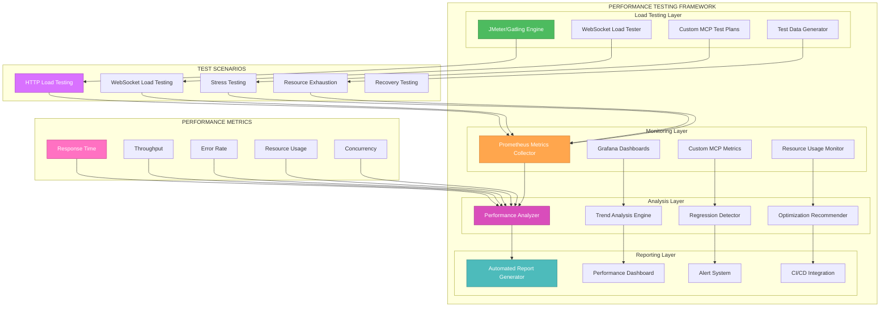
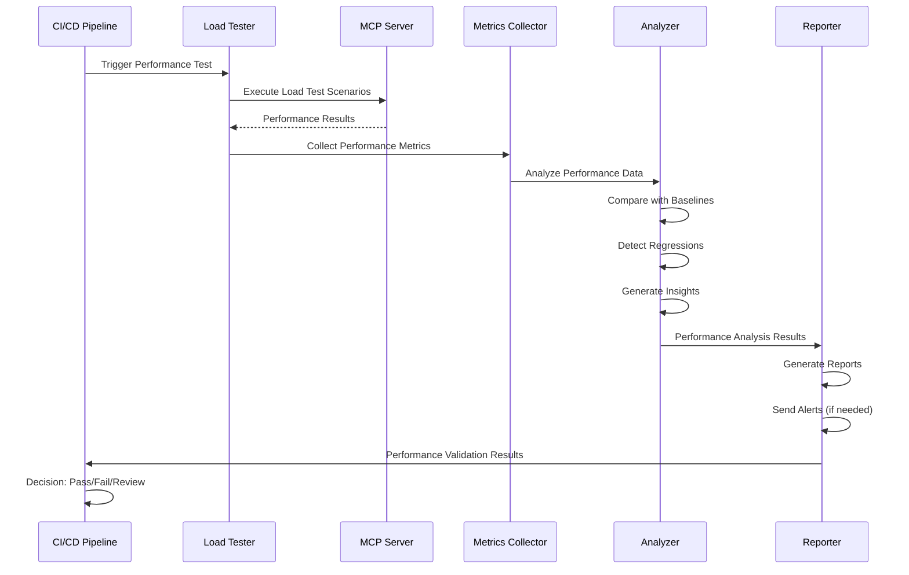

# 🎨🎨🎨 ENTERING CREATIVE PHASE: PERFORMANCE TESTING FRAMEWORK 🎨🎨🎨

**Focus**: Adaptive system for continuous performance monitoring and benchmarking throughout development  
**Objective**: Design comprehensive mechanisms for load testing, stress testing, and resource usage analysis with actionable insights  
**Requirements**: KPIs, thresholds, automated reporting workflows, and continuous performance validation

## PROBLEM STATEMENT

The MCP client-server integration requires a sophisticated performance testing framework that can:
- Continuously monitor performance metrics during development and testing
- Provide real-time benchmarking against established baselines
- Support load testing with configurable user scenarios and traffic patterns
- Implement stress testing to identify system breaking points and recovery capabilities
- Analyze resource usage patterns (CPU, memory, network, disk) across different scenarios
- Establish meaningful KPIs and thresholds for performance validation
- Generate automated reports with actionable insights and trend analysis
- Support performance regression detection and alerting
- Enable performance optimization through detailed analysis and profiling
- Integrate with CI/CD pipelines for automated performance validation

## OPTIONS ANALYSIS

### Option 1: Traditional Load Testing Framework
**Description**: Standard load testing approach using tools like JMeter or Gatling with basic monitoring

**Pros**:
- Well-established tools with proven effectiveness
- Good integration with existing test infrastructure
- Comprehensive reporting and analysis capabilities
- Supports various protocols (HTTP, WebSocket, etc.)
- Large community and extensive documentation
- Can handle complex test scenarios and parameterization

**Cons**:
- Limited real-time monitoring capabilities
- May not provide deep application-level insights
- Requires separate infrastructure for continuous monitoring
- Limited integration with development workflows
- May not scale well for distributed testing scenarios
- Higher learning curve for complex configurations

**Complexity**: Medium  
**Implementation Time**: 4-6 weeks

### Option 2: APM-Integrated Performance Framework
**Description**: Application Performance Monitoring (APM) tools integrated with custom testing framework

**Pros**:
- Deep application-level performance insights
- Real-time monitoring and alerting capabilities
- Excellent integration with development workflows
- Comprehensive resource usage analysis
- Supports distributed tracing and profiling
- Good integration with CI/CD pipelines
- Provides detailed performance bottlenecks identification

**Cons**:
- Higher cost for commercial APM tools
- May require significant application instrumentation
- Can impact application performance during monitoring
- Complex setup and configuration
- May provide too much detail for simple performance testing
- Requires expertise in APM tool configuration

**Complexity**: High  
**Implementation Time**: 6-8 weeks

### Option 3: Cloud-Native Performance Platform
**Description**: Cloud-based performance testing platform with integrated monitoring and analytics

**Pros**:
- Highly scalable for distributed testing scenarios
- Built-in monitoring and analytics capabilities
- Excellent for testing cloud-native applications
- Supports global load testing from multiple locations
- Integrated reporting and dashboard capabilities
- Good for testing real-world network conditions
- Supports complex test scenarios and automation

**Cons**:
- Higher cost for cloud-based services
- Dependency on external service availability
- May not provide deep application-level insights
- Limited customization for specific requirements
- Data privacy and security concerns
- May not integrate well with on-premise development environments

**Complexity**: Medium  
**Implementation Time**: 4-6 weeks

### Option 4: Hybrid Performance Testing Framework
**Description**: Combination of open-source tools with custom monitoring and analytics

**Pros**:
- Cost-effective while providing comprehensive capabilities
- Highly customizable for specific requirements
- Good integration with existing infrastructure
- Supports both simple and complex testing scenarios
- Can leverage best-of-breed tools for different aspects
- Excellent for continuous integration and development workflows
- Provides deep insights through custom analytics

**Cons**:
- More complex to set up and maintain
- Requires integration between multiple tools
- May require custom development for specific features
- Higher initial development cost
- Requires expertise in multiple tools and technologies
- May need ongoing maintenance and updates

**Complexity**: High  
**Implementation Time**: 8-10 weeks

### Option 5: Microservices Performance Framework
**Description**: Distributed performance testing framework designed for microservices architecture

**Pros**:
- Excellent for testing distributed system performance
- Supports service-level performance analysis
- Good for testing inter-service communication
- Can simulate complex microservices scenarios
- Supports distributed tracing and monitoring
- Excellent for testing scalability and resilience
- Good integration with containerized environments

**Cons**:
- May be overkill for simple client-server testing
- Complex setup and orchestration requirements
- Higher resource overhead
- Requires sophisticated monitoring infrastructure
- May not be suitable for all testing scenarios
- Higher learning curve for team members

**Complexity**: Very High  
**Implementation Time**: 10-12 weeks

## DECISION

**Chosen Option**: Option 4 - Hybrid Performance Testing Framework

**Rationale**: 
The hybrid approach provides the optimal balance of cost-effectiveness, customization, and comprehensive capabilities. It leverages proven open-source tools while adding custom monitoring and analytics specific to our MCP client-server integration requirements. This approach can scale from simple load testing to complex distributed scenarios while providing deep insights into performance characteristics.

**Key Advantages for Our Use Case**:
- Supports both HTTP-based and WebSocket-based performance testing
- Provides comprehensive monitoring of MCP protocol performance
- Enables real-time collaboration performance analysis
- Integrates well with existing Spring Boot and HTTP testing infrastructure
- Supports continuous performance monitoring throughout development
- Provides actionable insights for performance optimization

## IMPLEMENTATION PLAN

### Phase 1: Core Performance Infrastructure (Weeks 1-2)
1. **Load Testing Framework Setup**
   - Implement JMeter or Gatling for HTTP-based load testing
   - Create custom test plans for MCP protocol scenarios
   - Set up WebSocket load testing capabilities
   - Implement test data management and parameterization

2. **Monitoring Infrastructure**
   - Set up Prometheus for metrics collection
   - Implement Grafana dashboards for visualization
   - Create custom metrics for MCP-specific performance indicators
   - Set up alerting and notification systems

### Phase 2: Advanced Performance Testing (Weeks 3-4)
1. **Stress Testing Framework**
   - Implement stress testing scenarios for system breaking points
   - Create resource exhaustion testing capabilities
   - Set up recovery testing for system resilience validation
   - Implement chaos engineering principles for failure testing

2. **Resource Usage Analysis**
   - Implement CPU, memory, and network monitoring
   - Create disk I/O and database performance analysis
   - Set up application-level profiling and bottleneck detection
   - Implement distributed tracing for complex scenarios

### Phase 3: KPIs and Thresholds (Weeks 5-6)
1. **Performance Metrics Definition**
   - Define MCP-specific KPIs (response time, throughput, error rates)
   - Establish baseline performance metrics
   - Create performance thresholds and SLAs
   - Implement performance regression detection

2. **Automated Reporting**
   - Create comprehensive performance reports
   - Implement trend analysis and forecasting
   - Set up automated report generation and distribution
   - Create performance optimization recommendations

### Phase 4: CI/CD Integration and Optimization (Weeks 7-8)
1. **Continuous Performance Validation**
   - Integrate performance testing with CI/CD pipelines
   - Implement automated performance regression detection
   - Set up performance gates for deployment validation
   - Create performance testing automation workflows

2. **Performance Optimization Framework**
   - Implement performance profiling and analysis tools
   - Create performance optimization recommendations engine
   - Set up A/B testing for performance improvements
   - Implement performance monitoring in production environments

## PERFORMANCE TESTING ARCHITECTURE

## PERFORMANCE TESTING WORKFLOW

## KEY PERFORMANCE INDICATORS (KPIs)

### Response Time Metrics
- **Average Response Time**: Mean response time across all requests
- **95th Percentile Response Time**: 95% of requests complete within this time
- **99th Percentile Response Time**: 99% of requests complete within this time
- **Maximum Response Time**: Longest response time observed

### Throughput Metrics
- **Requests Per Second (RPS)**: Number of requests processed per second
- **Concurrent Users**: Maximum number of simultaneous users supported
- **Tool Execution Rate**: Number of MCP tool executions per second
- **Data Transfer Rate**: Amount of data transferred per second

### Error Rate Metrics
- **Error Rate**: Percentage of failed requests
- **Timeout Rate**: Percentage of requests that timeout
- **Connection Failure Rate**: Percentage of connection failures
- **Protocol Error Rate**: Percentage of MCP protocol errors

### Resource Usage Metrics
- **CPU Usage**: Percentage of CPU utilization
- **Memory Usage**: Memory consumption in MB/GB
- **Network I/O**: Network bytes sent/received per second
- **Disk I/O**: Disk read/write operations per second

### MCP-Specific Metrics
- **Session Initialization Time**: Time to establish MCP session
- **Tool Discovery Time**: Time to retrieve available tools
- **Tool Execution Time**: Time to execute individual tools
- **Real-time Event Latency**: Latency for real-time collaboration events

## THRESHOLDS AND SLAS

### Performance Thresholds
- **Response Time**: < 500ms for 95% of requests
- **Throughput**: > 100 RPS under normal load
- **Error Rate**: < 1% for all request types
- **Resource Usage**: < 80% CPU, < 80% memory under peak load

### Service Level Agreements (SLAs)
- **Availability**: 99.9% uptime during business hours
- **Response Time**: 95% of requests < 1 second
- **Recovery Time**: < 5 minutes after failure
- **Data Consistency**: 100% consistency for critical operations

## TOOLS AND TECHNOLOGIES

### Load Testing Tools
- **JMeter**: Primary HTTP load testing tool
- **Gatling**: Alternative for high-performance scenarios
- **Custom WebSocket Load Tester**: For real-time collaboration testing
- **Artillery**: For API-focused load testing

### Monitoring Tools
- **Prometheus**: Metrics collection and storage
- **Grafana**: Visualization and dashboards
- **Micrometer**: Application metrics collection
- **Custom MCP Metrics**: Protocol-specific monitoring

### Analysis Tools
- **Custom Performance Analyzer**: Built-in analysis engine
- **Statistical Analysis**: R or Python for advanced analysis
- **Trend Analysis**: Custom algorithms for performance trending
- **Regression Detection**: Automated regression identification

### Reporting Tools
- **Custom Report Generator**: Automated report creation
- **Email Notifications**: Alert system for performance issues
- **Slack/Teams Integration**: Real-time notifications
- **Performance Dashboard**: Real-time performance monitoring

## VALIDATION

**Requirements Met**:
- ✅ Continuous Monitoring: Real-time performance tracking throughout development
- ✅ Load Testing: Comprehensive load testing with configurable scenarios
- ✅ Stress Testing: System breaking point identification and recovery testing
- ✅ Resource Analysis: CPU, memory, network, and disk usage monitoring
- ✅ KPIs and Thresholds: Well-defined performance metrics and SLAs
- ✅ Automated Reporting: Comprehensive reporting with actionable insights

**Technical Feasibility**: High - leverages proven open-source tools with custom enhancements

**Risk Assessment**: Medium - hybrid approach requires careful integration but provides comprehensive capabilities

🎨🎨🎨 EXITING CREATIVE PHASE - PERFORMANCE TESTING FRAMEWORK COMPLETE 🎨🎨🎨 