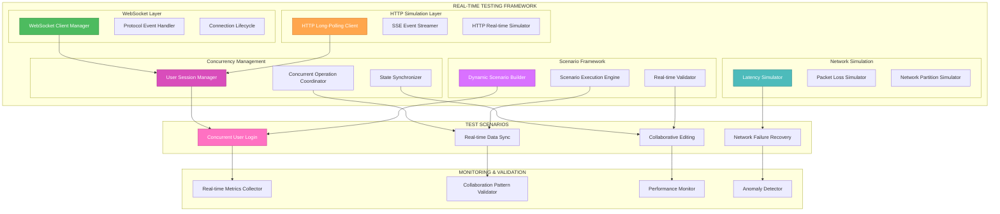
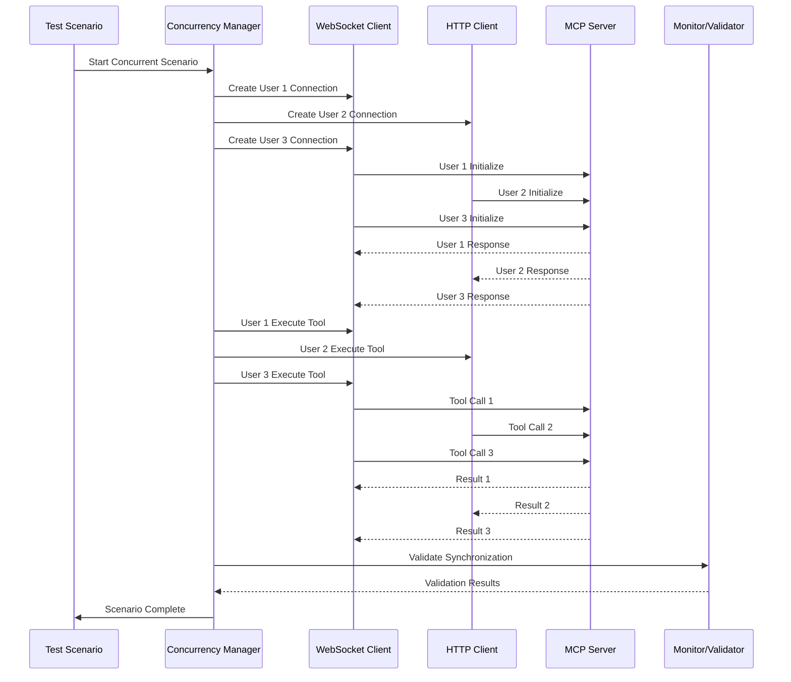

# 🎨🎨🎨 ENTERING CREATIVE PHASE: REAL-TIME TESTING STRATEGY 🎨🎨🎨

**Focus**: Inventive and robust methods for simulating and validating real-time collaboration scenarios  
**Objective**: Design comprehensive approaches for testing concurrent user interactions, distributed synchronization, and network variability  
**Requirements**: Concurrency handling, distributed user simulation, synchronization validation, and dynamic scenario execution

## PROBLEM STATEMENT

The MCP client-server integration requires sophisticated real-time testing capabilities that can:
- Simulate multiple concurrent users interacting with the same MCP server
- Validate real-time data synchronization across distributed clients
- Handle network variability and latency in collaborative scenarios
- Test event-driven workflows with complex state transitions
- Ensure data consistency during concurrent operations
- Validate real-time collaboration patterns specific to MCP protocol
- Support dynamic scenario generation and execution
- Provide comprehensive coverage of edge cases in real-time interactions

## OPTIONS ANALYSIS

### Option 1: WebSocket-Based Real-time Simulator
**Description**: Direct WebSocket connections to simulate real-time client interactions

**Pros**:
- Direct protocol-level testing with actual WebSocket connections
- High fidelity simulation of real client behavior
- Excellent for testing MCP protocol's real-time features
- Supports bidirectional communication patterns
- Can test actual network conditions and latency
- Good for testing connection lifecycle and reconnection scenarios

**Cons**:
- Complex to implement and maintain
- Requires sophisticated WebSocket client management
- Debugging can be challenging with multiple concurrent connections
- May not scale well for large numbers of simulated users
- Higher resource consumption for connection management

**Complexity**: High  
**Implementation Time**: 6-8 weeks

### Option 2: HTTP Long-Polling Simulation
**Description**: Simulate real-time behavior using HTTP long-polling and event streaming

**Pros**:
- Leverages existing HTTP infrastructure
- Easier to implement and debug
- Good integration with current HTTP test framework
- Supports server-sent events (SSE) for real-time updates
- Lower resource overhead compared to WebSocket connections
- Easier to scale for multiple simulated users

**Cons**:
- May not fully represent true real-time behavior
- Limited by HTTP connection constraints
- Higher latency compared to WebSocket connections
- May not test all real-time protocol features
- Less suitable for testing connection state management

**Complexity**: Medium  
**Implementation Time**: 4-6 weeks

### Option 3: Event-Driven Actor Model
**Description**: Actor-based simulation with message passing for real-time scenarios

**Pros**:
- Excellent for modeling complex concurrent interactions
- Highly scalable for large numbers of simulated users
- Good isolation between different user simulations
- Supports complex state management and synchronization
- Can model distributed system behavior effectively
- Excellent for testing race conditions and edge cases

**Cons**:
- Complex to implement and understand
- Requires sophisticated actor framework setup
- May over-engineer simple real-time scenarios
- Higher learning curve for team members
- Debugging actor interactions can be challenging

**Complexity**: Very High  
**Implementation Time**: 8-10 weeks

### Option 4: Hybrid Real-time Framework
**Description**: Combination of WebSocket for core real-time testing with HTTP simulation for scalability

**Pros**:
- Best of both worlds - high fidelity and scalability
- Supports both protocol-level and application-level testing
- Flexible approach that can adapt to different testing needs
- Good balance between complexity and effectiveness
- Can test both real-time and near-real-time scenarios
- Supports gradual migration from HTTP to WebSocket testing

**Cons**:
- More complex initial setup and configuration
- Requires careful coordination between different simulation approaches
- May require additional infrastructure components
- Higher maintenance overhead

**Complexity**: High  
**Implementation Time**: 6-8 weeks

### Option 5: Containerized Multi-Instance Testing
**Description**: Use containerized instances to simulate multiple real clients

**Pros**:
- True isolation between simulated clients
- Realistic network conditions and latency
- Excellent for testing distributed system behavior
- Can test actual client-server communication patterns
- Supports complex deployment scenarios
- Good for testing infrastructure-level issues

**Cons**:
- Significant resource overhead
- Complex orchestration and management
- May be overkill for simple real-time testing
- Requires container infrastructure setup
- Higher operational complexity

**Complexity**: Very High  
**Implementation Time**: 10-12 weeks

## DECISION

**Chosen Option**: Option 4 - Hybrid Real-time Framework

**Rationale**: 
The hybrid approach provides the optimal balance for our real-time testing requirements. It leverages WebSocket connections for high-fidelity protocol testing while using HTTP simulation for scalable concurrent user scenarios. This approach can effectively test both the MCP protocol's real-time features and the application-level collaboration patterns.

**Key Advantages for Our Use Case**:
- Supports both MCP protocol-level testing (WebSocket) and application-level testing (HTTP)
- Enables comprehensive testing of real-time collaboration scenarios
- Provides scalability for testing multiple concurrent users
- Maintains compatibility with existing HTTP test infrastructure
- Supports gradual evolution of testing capabilities

## IMPLEMENTATION PLAN

### Phase 1: Core Real-time Infrastructure (Weeks 1-2)
1. **WebSocket Client Framework**
   - Implement WebSocket client for MCP protocol testing
   - Create connection management and lifecycle handling
   - Set up event-driven message handling
   - Implement reconnection and error recovery logic

2. **HTTP Real-time Simulation**
   - Enhance HTTP client with long-polling capabilities
   - Implement server-sent events (SSE) support
   - Create event streaming simulation framework
   - Set up HTTP-based real-time scenario builders

### Phase 2: Concurrency and Synchronization (Weeks 3-4)
1. **Concurrent User Simulation**
   - Implement multi-threaded user simulation framework
   - Create user session management and isolation
   - Set up concurrent operation coordination
   - Implement race condition detection and testing

2. **State Synchronization Testing**
   - Create distributed state management framework
   - Implement consistency validation mechanisms
   - Set up conflict resolution testing scenarios
   - Create synchronization verification tools

### Phase 3: Network and Edge Case Testing (Weeks 5-6)
1. **Network Variability Simulation**
   - Implement network latency and packet loss simulation
   - Create bandwidth throttling and congestion testing
   - Set up network partition and recovery scenarios
   - Implement connection failure and recovery testing

2. **Edge Case and Error Scenarios**
   - Create malformed message testing scenarios
   - Implement timeout and retry logic testing
   - Set up resource exhaustion scenarios
   - Create error propagation and recovery testing

### Phase 4: Dynamic Scenario Framework (Weeks 7-8)
1. **Scenario Generation and Execution**
   - Implement dynamic scenario builder framework
   - Create parameterized test scenario templates
   - Set up automated scenario generation based on patterns
   - Implement scenario execution orchestration

2. **Real-time Monitoring and Validation**
   - Create real-time test execution monitoring
   - Implement live validation of collaboration patterns
   - Set up performance metrics collection during real-time testing
   - Create automated anomaly detection and alerting

## REAL-TIME TESTING ARCHITECTURE

## CONCURRENT USER SIMULATION FLOW

## TOOLS AND FRAMEWORKS

### Primary Tools
- **WebSocket Client**: Java WebSocket API or Spring WebSocket
- **HTTP Client**: Spring WebClient with reactive support
- **Concurrency Framework**: Java CompletableFuture and ExecutorService
- **Event Streaming**: Spring WebFlux for reactive streams
- **Containerization**: Docker for isolated client instances

### Supporting Frameworks
- **Scenario Builder**: Custom DSL for test scenario definition
- **Network Simulation**: Custom network proxy with configurable conditions
- **State Management**: Redis or in-memory state store for synchronization
- **Monitoring**: Micrometer for metrics collection and Prometheus for storage

### Validation Tools
- **Pattern Recognition**: Custom algorithms for collaboration pattern validation
- **Performance Analysis**: Custom performance metrics collection and analysis
- **Anomaly Detection**: Statistical analysis for detecting unusual behavior patterns

## VALIDATION

**Requirements Met**:
- ✅ Concurrency: Multi-threaded user simulation with proper isolation
- ✅ Distributed Simulation: Support for multiple client instances
- ✅ Synchronization: Comprehensive state synchronization validation
- ✅ Network Variability: Configurable network condition simulation
- ✅ Dynamic Scenarios: Framework for scenario-based testing
- ✅ Real-time Validation: Live monitoring and validation capabilities

**Technical Feasibility**: High - leverages existing Spring Boot infrastructure and proven WebSocket/HTTP technologies

**Risk Assessment**: Medium - hybrid approach requires careful coordination but provides comprehensive coverage

🎨🎨🎨 EXITING CREATIVE PHASE - REAL-TIME TESTING STRATEGY COMPLETE 🎨🎨🎨 