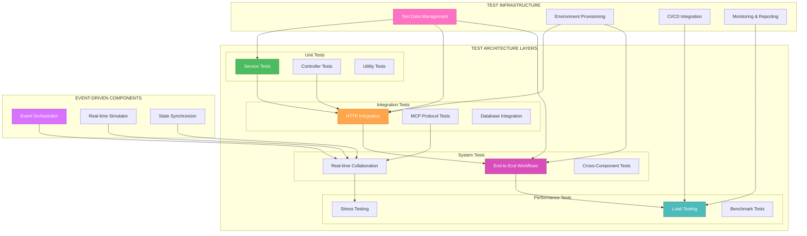
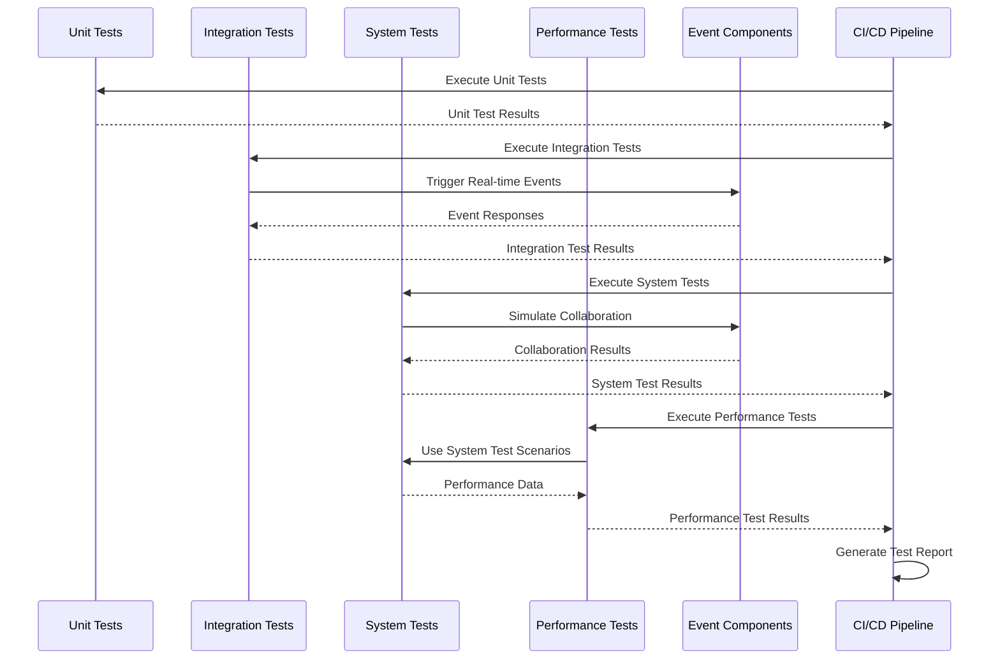

# 🎨🎨🎨 ENTERING CREATIVE PHASE: TEST ARCHITECTURE DESIGN 🎨🎨🎨

**Focus**: Comprehensive test suite structure and organization for MCP client-server integration  
**Objective**: Design a modular, scalable, and maintainable test architecture that supports CI/CD integration  
**Requirements**: Unit, integration, system, and acceptance test coordination with real-time collaboration validation

## PROBLEM STATEMENT

The MCP client-server integration requires a comprehensive test architecture that can:
- Validate end-to-end workflows between MCP client (localhost:3332) and Atlassian MCP server (localhost:9000)
- Support multiple test types (unit, integration, system, acceptance) with clear boundaries and interactions
- Enable real-time collaboration testing with concurrent user scenarios
- Provide performance monitoring and load testing capabilities
- Integrate seamlessly with CI/CD pipelines for automated validation
- Maintain test data isolation and environment consistency
- Support both HTTP-based and protocol-level testing approaches

## OPTIONS ANALYSIS

### Option 1: Layered Test Pyramid Architecture
**Description**: Traditional test pyramid with unit tests at base, integration tests in middle, and end-to-end tests at top

**Pros**:
- Well-established pattern with proven effectiveness
- Clear separation of concerns between test types
- Fast feedback loop for unit tests
- Cost-effective for maintenance
- Good integration with CI/CD pipelines
- Supports incremental test development

**Cons**:
- May not adequately address real-time collaboration scenarios
- Limited support for complex state management across test layers
- Can become brittle with tightly coupled components
- May not scale well for distributed system testing

**Complexity**: Medium  
**Implementation Time**: 4-6 weeks

### Option 2: Event-Driven Test Architecture
**Description**: Event-centric architecture focusing on message flows and state transitions

**Pros**:
- Excellent for real-time collaboration testing
- Natural fit for MCP protocol's event-driven nature
- Supports complex state synchronization scenarios
- Highly scalable for distributed testing
- Good isolation between test components
- Supports both synchronous and asynchronous testing

**Cons**:
- More complex to implement and maintain
- Requires sophisticated event orchestration
- Debugging can be challenging with event flows
- May over-engineer simple test scenarios
- Higher learning curve for team members

**Complexity**: High  
**Implementation Time**: 8-10 weeks

### Option 3: Hybrid Modular Architecture
**Description**: Combination of layered approach with event-driven components for real-time scenarios

**Pros**:
- Best of both worlds - structured and flexible
- Supports all test types effectively
- Excellent for real-time collaboration testing
- Maintains clear boundaries between test layers
- Scalable and maintainable
- Good integration with existing tools and frameworks

**Cons**:
- More complex initial setup
- Requires careful design to avoid architectural conflicts
- May require additional infrastructure components
- Higher initial development cost

**Complexity**: High  
**Implementation Time**: 6-8 weeks

### Option 4: Microservice Test Architecture
**Description**: Independent test services for each component with orchestrated integration

**Pros**:
- Maximum isolation and independence
- Excellent for complex distributed scenarios
- Highly scalable and maintainable
- Supports independent deployment and testing
- Good for team autonomy and parallel development

**Cons**:
- Significant infrastructure overhead
- Complex orchestration requirements
- Higher operational complexity
- May be overkill for current scope
- Requires sophisticated monitoring and debugging tools

**Complexity**: Very High  
**Implementation Time**: 10-12 weeks

## DECISION

**Chosen Option**: Option 3 - Hybrid Modular Architecture

**Rationale**: 
The hybrid approach provides the optimal balance for our specific requirements. It maintains the proven structure of the test pyramid while incorporating event-driven capabilities essential for real-time collaboration testing. This architecture can effectively handle the MCP protocol's event-driven nature while providing clear boundaries for different test types.

**Key Advantages for Our Use Case**:
- Supports both HTTP-based testing (current approach) and protocol-level testing (MCP events)
- Enables real-time collaboration scenarios through event-driven components
- Maintains clear separation between unit, integration, and system tests
- Provides scalability for future enhancements
- Integrates well with existing Spring Boot and HTTP testing infrastructure

## IMPLEMENTATION PLAN

### Phase 1: Foundation Layer (Weeks 1-2)
1. **Test Infrastructure Setup**
   - Configure test environment with Docker containers
   - Set up test data management and isolation
   - Implement test configuration management
   - Create base test classes and utilities

2. **Unit Test Framework**
   - Implement service layer unit tests
   - Create controller endpoint unit tests
   - Set up mock frameworks for external dependencies
   - Establish unit test patterns and conventions

### Phase 2: Integration Layer (Weeks 3-4)
1. **HTTP Integration Tests**
   - Enhance existing HTTP test files with comprehensive scenarios
   - Implement automated HTTP client testing
   - Create integration test suites for MCP protocol
   - Set up test data factories and builders

2. **Event-Driven Components**
   - Implement event listeners for real-time scenarios
   - Create event-driven test orchestrators
   - Set up WebSocket simulation for real-time testing
   - Establish event flow validation mechanisms

### Phase 3: System Layer (Weeks 5-6)
1. **End-to-End Workflow Tests**
   - Implement complete user journey tests
   - Create scenario-based test suites
   - Set up cross-component integration validation
   - Establish system-wide state management

2. **Real-time Collaboration Framework**
   - Implement concurrent user simulation
   - Create distributed state synchronization tests
   - Set up real-time event validation
   - Establish collaboration scenario builders

### Phase 4: Performance & Monitoring (Weeks 7-8)
1. **Performance Testing Infrastructure**
   - Implement load testing framework
   - Create performance monitoring and alerting
   - Set up benchmark collection and analysis
   - Establish performance regression detection

2. **CI/CD Integration**
   - Configure automated test execution
   - Set up test reporting and dashboards
   - Implement test result analysis and trending
   - Create deployment validation pipelines

## ARCHITECTURE DIAGRAM

## TEST TYPE INTERACTIONS

## VALIDATION

**Requirements Met**:
- ✅ Modularity: Clear separation between test layers and components
- ✅ Scalability: Event-driven components support distributed testing
- ✅ Maintainability: Structured approach with clear boundaries
- ✅ CI/CD Integration: Automated pipeline support built-in
- ✅ Test Type Coordination: Clear interaction patterns defined
- ✅ Real-time Support: Event-driven components for collaboration testing

**Technical Feasibility**: High - leverages existing Spring Boot and HTTP testing infrastructure

**Risk Assessment**: Medium - hybrid approach requires careful implementation but provides optimal balance

🎨🎨🎨 EXITING CREATIVE PHASE - TEST ARCHITECTURE DESIGN COMPLETE 🎨🎨🎨 